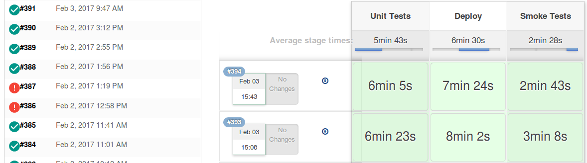

================================
Building & Deploying Tutorial
================================

(work in progress)

At some point, the `my-package` app should be built, so it can run somewhere
else than on localhost:6543. In Spynl, this means starting a job on Jenkins,
where the following stages happen:

* All tests are run
* A Docker image is built and deployed to your dev container registry
* Smoke tests are run against a freshly-started container based on that tnew
  image

There is only one `spynl` command necessary here: `spynl dev.start_build`.
However, some services need to be set up and configured, namely Jenkins and
one or two container registries.

Creating a Jenkins job
---------------------------
`Jenkins <https://jenkins.io>`_ is an open-source build server.
We'll assume in this tutorial that you installed one locally and have it
Configuring your Spynl plugin for Deployment running at http://localhost:8080.
Jenkins needs `Docker engine <https://docs.docker.com/engine/installation/>`_ installed on it,
plus `aws-utils <https://www.npmjs.com/package/aws-utils>`_ (?)
and any libraries you need for tests to be run.

Spynl uses the `Pipeline feature <https://jenkins.io/solutions/pipeline/>`_
of Jenkins. Here is how Jenkins displays your build history:

If any error happens, your build has failed - the stage is coloured red and the
pipeline aborts.

After you have set up a Jenkins server, you need to create a `Pipeline` job called "Spynl".
In the Jenkins web interface, navigate to `Jenkins` -> `New Item` -> `Pipeline`.

Configure the Pipeline "Definition" to be a `Pipeline script from SCM`, the
"SCM" to be `Git` and the "Repository URL" to be `https://github.com/SoftwearDevelopment/spynl.git`.
under "Branches to build", add `refs/heads/$spynlbranch`.

Finally you need to add a few String parameters to the job:

* `scm_urls`
* `revision`
* `fallbackrevision` (default: `$revision`)
* `task`
* `spynlbranch`

That's it! Save the Jenkins job.

Configuring your Spynl plugin for Jenkins
-------------------------------------------

Add the following ini-setting to `development.ini`:

.. code:: shell

    [app:main]
    spynl.ops.jenkins_url: http://localhost:8080

Now we can start a build:

.. code:: shell

    $ spynl ops.start_build

This will build the `master` branch on `spynl` as well as `my-package`. See
`spynl --help ops.start_build` for more options.

Configuring your Spynl plugin for Deployment
----------------------------------------------

(TODO: more verbose, this is an outline)

At the moment, Jenkins will be able to build a Docker image, but will fail to
push it anywhere.

Set at least these two ini-settings:

* `spynl.ops.ecr.dev_tasks`
* `spynl.ops.ecr.dev_url`

You also need to set the `task` parameter to `spynl ops.start_build`. It needs
to be one (or more) of `spynl.ops.ecr.dev_tasks` and a task that exists in your
development container service (e.g. `in AWS <https://aws.amazon.com/ecs/>`_):

.. code:: shell

    spynl ops.start_build --task dev

Now Jenkins can deploy that image to your development container registration and
for that task and restart that task so it will serve your new container. 

Configuring your Spynl plugin for Smoke Testing
--------------------------------------------------

The third stage in the pipeline is the smoke test. Out of the box, Spynl checks
if a container actually exists at the location you want your container service to
serve them. Add the following ini-setting:

`spynl.ops.dev_url`

Spynl also checks if this image has been built within the last 15 minutes.

Your app can specify it's own smoke tests (TODO: write one in my-package)

Deploying to your production environment
------------------------------------------------

(TODO: more verbose)

Set this ini-setting:

.. code:: shell

    spynl.ops.ecr.prod_url: 

Run the `dev.start_build` task

.. code:: shell

    spynl ops.start_build --task production

TODO: At the moment, Spynl only pushes the new image to that registry. 
We could make it an ini-setting if Spynl shoiuld try to restart a task there.
