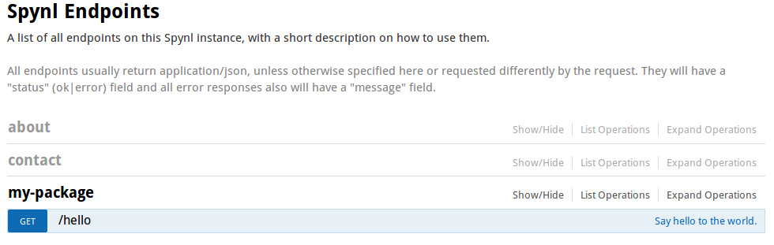
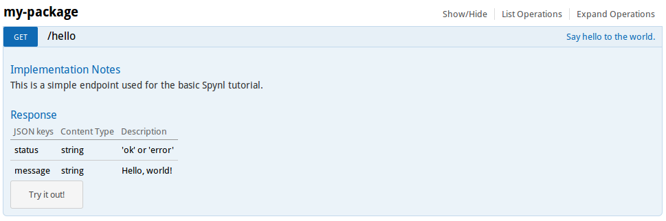

=====================
Development tutorial
=====================

In this minimalistic tutorial we will make a Spynl plugin called `my-package` with one endpoint.
It will be served in a dev environment, documented, tested and translated.
We will build the code part by part, but you can browse :ref:`my-package-index`.

The `spynl` CLI has support for common tasks in the development cycle, which
we'll use as they become relevant.

A plugin with one endpoint
----------------------------

First, you probably want to `make a virtual environment and activate it <http://docs.python-guide.org/en/latest/dev/virtualenvs/>`_.
Remember to use Python3, preferrably >= 3.5.

Then we install Spynl:

.. code:: shell
    
    $ pip install spynl

Now we'll create a folder for our package

.. code:: shell

    $ cd $VIRTUAL_ENV/src
    $ mkdir my-package
    $ touch my-package/setup.py my-package/hello_world.py

Here is the content of our (very) simple `setup.py`, where we state that
`my-package` is a Spynl plugin:

.. code:: python

    from setuptools import setup

    setup(name='my-package',
        entry_points={
            'spynl.plugins': [
                'hello_world = 1',
            ]
        }
       )

This says that `hello_world.py` should be plugged into the Spynl application.
What this means is that Spynl calls Pyramid's `config.include <http://docs.pylonsproject.org/projects/pyramid/en/latest/api/config.html#pyramid.config.Configurator.include>`_ function, passing the `hello_world`
module to it. Therefore, Pyramid expects a function `hello_world.includeme`,
which we'll write below.

`spynl_plugins` is a list, so we could add other modules if that would suit our code
organisation in `my-package`. For that matter, we could also add other packages
who also define `spynl.plugins` entry points.

And here is `hello_world.py`. We write one endpoint and the registration for it:

.. code:: python

    def hello(request):
        return dict(message="Hello, world!")

    def includeme(config):
        config.add_endpoint(hello, 'hello')

The `hello` function is a pretty vanilla endpoint. It returns a dictionary.
This would mean Spynl returns it as `application/json` (it's default response
type), but it could also be served as XML or even YAML (read more about
:ref:`serialisation`).

The `includeme` function gets a Pyramid 
`config <http://docs.pylonsproject.org/projects/pyramid/en/latest/api/config.html>`_
object, on which we can in principle do everything one can do when writing a pure
Pyramid application. We don't need anything but `config.add_endpoint` however,
which is actually unique to Spynl (it does some extra magic w.r.t. documentation
and route management).

Finally, we develop our package so Spynl knows about it and serve the application:

.. code:: shell

    $ python setup.py develop 
    $ spynl dev.serve

(As you see, the `spynl` CLI command works from anywhere when you have your 
virtual environment activated).

The endpoint http://localhost:6543/hello answers:

.. code:: json

    {
        "status": "ok",
        "message": "Hello, world!"
    }

Adding documentation for the endpoint
-----------------------------------------

Now let's document the endpoint for frontend developers:

.. code:: python

    def hello(request):
        """
        Say hello to the world.

        ---
        get:
        description: >

            ####Response

            JSON keys | Content Type | Description\n
            --------- | ------------ | -----------\n
            status    | string | 'ok' or 'error'\n
            message   | string | Hello, world!\n

        tags:
            - my-package
        show-try: true
        """
        return dict(message="Hello, world!")

    def includeme(config):
        config.add_endpoint(hello, 'hello')

Then, the Swagger doc at http://localhost/about/endpoints actually lists our endpoint:

Click on the endpoint to see details or try it out:

We are not using Swagger to its full potential here w.r.t. to its schema
capabilities, we know. We chose not to, you can choose otherwise.

Serve on localhost
-----------------------

You already saw how to serve the app:

.. code:: bash

    $ spynl dev.serve

Getting help about spynl CLI tasks
--------------------------------------

Now that we begin using the `sspynl` CLI, we should note that for each CLI task,
you can get help:

.. code:: shell

    $ spynl --help dev.serve
    Usage: spynl [--core-opts] dev.serve [other tasks here ...]

    Docstring:
    Run a local server. The ini-file development.ini is searched for in
    installed Spynl plugins. If there is none, minimal.ini is used.

    Options:
    none

Testing the endpoint
-----------------------

Let's write a simple test in `my-package/test_hello.py`:

.. code:: python

    import pytest
    from webtest import TestApp
    from spynl.main import main

    @pytest.fixture(scope="session")
    def app():
        spynl_app = main(None)
        return TestApp(spynl_app)

    def test_hello(app):
        response = app.get('/hello', status=200)
        assert response.json['message'] == "Hello, world!"

Then, we can run:

.. code:: shell

    $ spynl dev.test

I hope you saw this (the dot says it succeeded):

.. code:: shell

    [spynl dev.test] Testing package: my-package
    ============================= test session starts ==============================
    platform linux -- Python 3.5.2, pytest-3.0.5, py-1.4.32, pluggy-0.4.0
    rootdir: /home/nicolas/workspace/spynl-git/venv/src/my-package, inifile: 
    plugins: sugar-0.8.0, cov-2.4.0, raisesregexp-2.1
    collected 1 items

    test_hello.py .

Adding translations
------------------------

Then we have support for translating the app. Let us add a translatable string
to the hello_world endpoint:

.. code:: python

    from spynl.main.locale import SpynlTranslationString as _
    
    def hello(request):
        return dict(message=_('hello-msg', default="Hello, world!"))

We can now refresh the translation catalogue of our package:

.. code:: shell

    $ spynl dev.translate --packages my-package --languages nl --action refresh
    [spynl dev.translate] Package: my-package ...
    [spynl dev.translate] Creating locale folder ...
    running extract_messages
    extracting messages from hello_world.py
    extracting messages from setup.py
    extracting messages from test_hello.py
    writing PO template file to ./locale/messages.pot
    [spynl dev.translate] File ./locale/nl/LC_MESSAGES/my-package.po does not exist. Initializing.
    running init_catalog
    creating catalog ./locale/nl/LC_MESSAGES/my-package.po based on ./locale/messages.pot
    [spynl dev.translate] Done with language nl.
    --------------------------------------------------

Spynl created all necessary folders and initialised a catalogue. Now a human
needs to translate our string to Dutch. Make this change in
`my-package/locale/nl/LC_MESSAGES/my-package.po`:

.. code:: shell

    #: hello_world.py:23
    msgid "hello-msg"
    msgstr "Hallo, Wereld!"

Then we can compile the catalogue, so that Spynl will serve Dutch when it
should:

.. code:: shell

    $ spynl dev.translate --packages my-package --languages nl                 
    [spynl dev.translate] Package: my-package ...
    [spynl dev.translate] Located locale folder in /home/nicolas/workspace/spynl/venv/src/my-package ...
    running compile_catalog
    compiling catalog /home/nicolas/workspace/spynl/venv/src/my-package/locale/nl/LC_MESSAGES/my-package.po to /home/nicolas/workspace/spynl/venv/src/my-package/locale/nl/LC_MESSAGES/my-package.mo
    [spynl dev.translate] Done with language nl.
    --------------------------------------------------

There are ony two actions, `refresh` and `compile`.
If the `--action` parameter is not given, `spynl dev.translate` compiles.

The compilation step is not necessary and you don't have to include the binary
.mo file in your SCM. When we build a Docker image on Jenkins (see below),
Jenkins runs the compile action.

we need to tell Pyramid that the new locale directory exists. Add this
to the `include_me` function in `my-package/hello_world.py`:

.. code:: python

    config.add_translation_dirs('%s/src/my-package/locale'
                                % os.environ['VIRTUAL_ENV'])

Now we want to see our app serve Dutch. We still need to configure the list
of languages we serve in our app. This is a great opportunity to start
using our own `.ini` file. Copy Spynl's `minimal.ini` to `my-package/development.ini`
and add the `spynl.languages` setting in the `[app:main]` section:

.. code:: shell

    [app:main]
    use = egg:spynl
    spynl.pretty = 1
    spynl.languages = nl,en
   
It is crucial which language is first in this list. Because `nl` is first, we'll
get a Dutch reply from Spynl, e.g.by visiting http://localhost:6543:

.. code: json

    {
        "message": "Geen endpoint gevonden voor pad '/'.",
        "status": "error",
        "type": "HTTPNotFound"
    }

FIXME: However, http://localhost:6543/hello still returns english ...

Tab completion for the spynl CLI
---------------------------------

Now that we're `spynl` power users, it's time to reveal an important feature:
There is tab completion for the `spynl` CLI. To activate it, run

.. code:: shell

    $ source $VIRTUAL_ENV/lib/python3.5/site-packages/spynl/spynl/cli/zsh.completion

(you might need to adapt the path to spynl, it depends on your environment and
method of installation)

You can list (a subset of) tasks by pressing TAB and if the task is complete also the available options.
To see options, type a dash ("-") and the press TAB.

This is available for `bash` and `fish` as well, simply replace `zsh` in the
command.

Installing the package from SCM
---------------------------------

Of course, we will want to use Source Code Management (SCM) for our own code,
e.g. on github or bitbucket. `spynl` provides a task called `dev.install` which
makes it easy to get started in a new dev environment with developing your app
further.

Let's assume your project uses git as SCM and lives in a bitbucket repo:

.. code:: shell
    
    $ spynl dev.install --scm-url git@bitbucket.org:my-team/my-package.git

`spynl dev.install` will clone the code and develop it. 

In general, Spynl also supports mercurial repositories.

There are some configuration options here (try `spynl --help dev.install` for
all of them). For example, let's assume you work want to work with a feature
branch and you want/need to specify in which directory the code should be installed:

.. code:: shell

    $ spynl dev.install --scm-url git@bitbucket.org:my-team/my-package.git --revision me/some-feature --src_path path/to/my/virtualenv/src

`spynl dev.install` can also install non-Python dependencies for you or do any
other things pre- or post-installation. See `setup.sh.template` in the main Spynl repo. (TODO: point to actual documentation of `setup.sh`).
